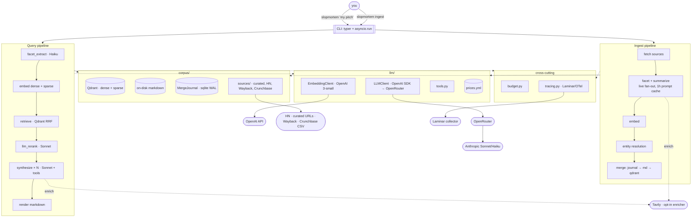

# slopmortem

You give it a pitch, it finds dead startups that tried something similar.

`slopmortem` runs locally. LLM calls go through OpenRouter, which sends them to Anthropic's Sonnet and Haiku by default. Embeddings come from OpenAI. Qdrant runs in Docker.

## Architecture



The CLI does one `asyncio.run` and that's it. Below that, every stage is `async def`. fastembed is CPU-bound, so it hops onto a thread. The synthesis fan-out goes through `asyncio.gather`. Each SDK keeps one connection pool alive for the whole invocation. You don't think that matters until you watch six sequential LLM calls each pay the TLS handshake tax.

## Query flow

You type `slopmortem "we're building a marketplace for industrial scrap metal"`. Here's what runs.

1. **Facets.** Haiku reads the pitch and slaps structured fields on it: sector, business model, stage, that kind of thing. These narrow what we retrieve and feed the rerank rubric later.
2. **Embeddings.** Dense via OpenAI `text-embedding-3-small`. Sparse via fastembed BM25. Two vectors per query, both cheap.
3. **Retrieve.** Qdrant runs three prefetches in parallel (dense, sparse, and one filtered by your facets), then fuses them server-side with Reciprocal Rank Fusion. Top 30 come back. No HyDE, no query rewriting. We skipped HyDE because Haiku has a known habit of rewriting pitches as post-mortem openings stuffed with its favorite failure tropes ("ran out of runway", "scaled too fast"), and that would bias retrieval toward generic-failure clusters. Rerank at K=30 → N=5 should absorb the modality gap. Revisit in v2 if real-pitch recall measures poorly.
4. **Rerank.** One Sonnet call scores all 30 against a multi-perspective rubric. Output is JSON via OpenRouter's `response_format=json_schema`, which routes to Anthropic's grammar-constrained sampling on the backend. No tools, no corpus reads, nothing to parse out of prose. Top 5 survive.
5. **Synthesize.** The first call runs alone, on purpose. It writes the prompt cache so the other four don't race to write the same prefix. We assert `cache_creation_tokens > 0` on that warm response, because Anthropic's cache is eventually consistent across regions and a 200 OK doesn't actually mean the prefix replicated yet. One re-warm retry if it didn't. Then the rest fan out under `anyio.CapacityLimiter(N)` with `asyncio.gather(..., return_exceptions=True)`, so one flaky candidate drops one report instead of killing all five. The model can hit `get_post_mortem` or `search_corpus` mid-generation if it wants more context. Final text parses straight into the `Synthesis` Pydantic model.
6. **Render.** Markdown to stdout. The footer carries cost, latency, and the trace ID, so when something looks weird you paste a Laminar link straight from the terminal.

A default query runs around $0.45–0.60 and 21–43 seconds. Turn on Tavily synthesis enrichment and that becomes $0.60–0.80 and 31–63 seconds. Cap is $2.00. The budget tracker raises if you blow past it.

## Ingest flow

`slopmortem ingest` is the bulk path. Default sources are a curated YAML and HN's Algolia API; the Wayback Machine and a Crunchbase CSV are opt-in adapters. Tavily is an opt-in enricher (synthesis-time or ingest-time), not a source.

1. **Fetch.** Plain HTTP. trafilatura strips nav and cookie banners. A length floor drops the obviously empty pages.
2. **LLM fan-out.** Two calls per doc, one for facets and one for the rerank summary. All ~1000 run live under `anyio.CapacityLimiter(20)`. No Batches discount here because OpenRouter doesn't proxy that API. The shared system block sets `cache_control={"ttl":"1h"}`, and we fire one sync call right before the fan-out so workers hit a populated cache instead of racing to write it. The first five responses sample `cache_read_tokens / (cache_read + cache_creation)`. If the read ratio is under 80% we know before spending the rest of the budget. The 1-hour TTL recovers most of what Batches would have saved.
3. **Embed.** Dense via OpenAI. Sparse on the local CPU. The line item never showed up large enough to fight over.
4. **Entity resolution.** Three tiers. Domain match first, then embedding similarity, then a Haiku tiebreaker for the actually ambiguous pairs. The point of all this is to stop "Crunchbase obituary + founder's farewell blog post" from showing up as two separate dead startups.
5. **Merge.** Journal flips the row to `pending`, markdown lands via `os.replace`, Qdrant gets upserted, then the journal flips to `complete`. If something dies in the middle (Ctrl-C, OOM, bad network, whatever), `slopmortem ingest --reconcile` walks the three stores and patches whatever drifted.

The initial 500-URL seed costs about $7.50. The cap is $15 because retries happen, the no-Batches path has less cushion, and I wanted slack. Steady-state on the HN feed is roughly $0.10/week, small enough that I stopped tracking it.

## What's where

```
slopmortem/
  cli.py                 # entry point; every command goes through asyncio.run
  pipeline.py            # query orchestration, async stage composition
  ingest.py              # ingest orchestration
  stages/                # one module per stage; every function is async def
  llm/
    client.py            # LLMClient Protocol + OpenRouterClient (openai SDK pointed
                         #   at openrouter.ai/api/v1) + FakeLLMClient
    embedding_client.py  # OpenAI + Fake variants
    tools.py             # synthesis_tools(config) factory; Pydantic → OpenAI-shape
                         #   tool schema (OpenRouter forwards to Anthropic backends)
    prices.yml           # source of truth for $$
    prompts/             # *.j2 templates with paired JSON Schemas
  corpus/
    sources/             # curated, hn_algolia, tavily
    qdrant.py            # hybrid retrieval (dense + sparse + facet RRF)
    merge.py             # MergeJournal (stdlib sqlite3, WAL, busy_timeout=5000)
    paths.py             # safe_path validation for raw/ and canonical/ trees
  tracing.py             # Laminar/OTel; loopback default
  budget.py              # per-invocation cost cap
  config.py
data/
  journal.sqlite         # merge journal
  raw/<source>/<id>.md   # one file per fetched source doc
  canonical/<id>.md      # one file per merged canonical entry
docs/specs/              # design spec + open issues
tests/
  cassettes/             # pytest-recording (vcrpy under the hood, no respx)
  fixtures/
  evals/
```

## Running it

`OPENROUTER_API_KEY` and `OPENAI_API_KEY` go in `.env`. Tavily is optional. Qdrant runs in Docker.

```
uv sync
docker-compose up -d qdrant
slopmortem ingest --source curated   # ~$7.50, run this once
slopmortem "your pitch here"         # ~$0.50, run whenever
```

Two corners worth knowing about. `slopmortem ingest --reconcile` patches drift between the journal, the markdown tree, and Qdrant. `slopmortem replay --dataset <name>` re-runs a saved input through current code, which is what you want when you're iterating on prompts and don't feel like reburning the LLM bill on the same examples.

## Testing

Cassettes via pytest-recording, vcrpy underneath. I don't pair it with respx because both libraries patch the same httpx transport layer, and when they coexist you get fixture-order flakes that aren't local to whatever test is actually broken. One library is enough.

`just smoke-live` hits live OpenRouter on a manual trigger, roughly weekly. The point is to catch when an SDK, a model, or OpenRouter's routing layer silently shifts behavior. Everything else replays from disk.

## Design notes

Full spec is in [`docs/specs/2026-04-27-slopmortem-design.md`](docs/specs/2026-04-27-slopmortem-design.md). The pre-implementation punch list of contract bugs to close before code is in [`docs/specs/2026-04-28-design-spec-blockers.md`](docs/specs/2026-04-28-design-spec-blockers.md).
