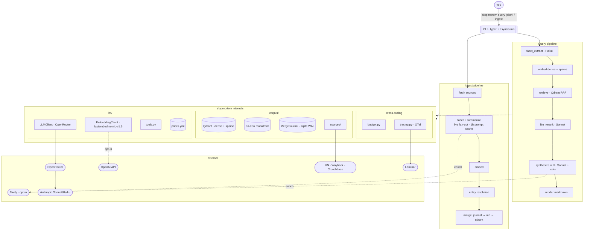

# slopmortem

You give it a pitch, it finds dead startups that tried something similar.

`slopmortem` runs locally. LLM calls go through OpenRouter, which sends them to Anthropic's Sonnet and Haiku by default. Embeddings run locally via fastembed (ONNX); flip to OpenAI if you'd rather. Qdrant runs in Docker.

## Architecture



The CLI does one `asyncio.run` and that's it. Below that, every stage is `async def`. fastembed is CPU-bound, so it hops onto a thread. The synthesis fan-out goes through `asyncio.gather`. Each SDK keeps one connection pool alive for the whole invocation. You don't think that matters until you watch six sequential LLM calls each pay the TLS handshake tax.

## Query flow

You type `slopmortem query "we're building a marketplace for industrial scrap metal"`. Here's what runs.

1. **Facets.** Haiku reads the pitch and slaps structured fields on it: sector, business model, stage, that kind of thing. These narrow what we retrieve and feed the rerank rubric later.
2. **Embeddings.** Dense via fastembed `nomic-ai/nomic-embed-text-v1.5` (local ONNX, 768d). Sparse via fastembed BM25. Two vectors per query, both free.
3. **Retrieve.** Qdrant runs three prefetches in parallel (dense, sparse, and one filtered by your facets), then fuses them server-side with Reciprocal Rank Fusion. Top 30 come back. No HyDE, no query rewriting. We skipped HyDE because Haiku has a known habit of rewriting pitches as post-mortem openings stuffed with its favorite failure tropes ("ran out of runway", "scaled too fast"), and that would bias retrieval toward generic-failure clusters. Rerank at K=30 → N=5 should absorb the modality gap. Revisit in v2 if real-pitch recall measures poorly.
4. **Rerank.** One Sonnet call scores all 30 against a multi-perspective rubric. Output is JSON via OpenRouter's `response_format=json_schema`, which routes to Anthropic's grammar-constrained sampling on the backend. No tools, no corpus reads, nothing to parse out of prose. Top 5 survive.
5. **Synthesize.** The first call runs alone, on purpose. It writes the prompt cache so the other four don't race to write the same prefix. We assert `cache_creation_tokens > 0` on that warm response, because Anthropic's cache is eventually consistent across regions and a 200 OK doesn't actually mean the prefix replicated yet. One re-warm retry if it didn't. Then the rest fan out under `anyio.CapacityLimiter(N)` with `asyncio.gather(..., return_exceptions=True)`, so one flaky candidate drops one report instead of killing all five. The model can hit `get_post_mortem` or `search_corpus` mid-generation if it wants more context. Final text parses straight into the `Synthesis` Pydantic model.
6. **Render.** Markdown to stdout. The footer carries cost, latency, and the trace ID, so when something looks weird you paste a Laminar link straight from the terminal.

A default query runs around $0.45–0.60 and 21–43 seconds. Turn on Tavily synthesis enrichment and that becomes $0.60–0.80 and 31–63 seconds. Cap is $2.00. The budget tracker raises if you blow past it.

## Ingest flow

`slopmortem ingest` is the bulk path. Default sources are a curated YAML and HN's Algolia API; the Wayback Machine and a Crunchbase CSV are opt-in adapters. Tavily is an opt-in enricher (synthesis-time or ingest-time), not a source.

1. **Fetch.** Plain HTTP. trafilatura strips nav and cookie banners. A length floor drops the obviously empty pages.
2. **LLM fan-out.** Two calls per doc, one for facets and one for the rerank summary. All ~1000 run live under `anyio.CapacityLimiter(20)`. No Batches discount here because OpenRouter doesn't proxy that API. The shared system block sets `cache_control={"ttl":"1h"}`, and we fire one sync call right before the fan-out so workers hit a populated cache instead of racing to write it. The first five responses sample `cache_read_tokens / (cache_read + cache_creation)`. If the read ratio is under 80% we know before spending the rest of the budget. The 1-hour TTL recovers most of what Batches would have saved.
3. **Embed.** Dense and sparse both on the local CPU. fastembed downloads a 550 MB ONNX model on first use and caches it under `~/.cache/fastembed`. CI runs `slopmortem embed-prefetch` once so the first ingest doesn't pay the download tax.
4. **Entity resolution.** Three tiers. Domain match first, then embedding similarity, then a Haiku tiebreaker for the actually ambiguous pairs. The point of all this is to stop "Crunchbase obituary + founder's farewell blog post" from showing up as two separate dead startups.
5. **Merge.** Journal flips the row to `pending`, markdown lands via `os.replace`, Qdrant gets upserted, then the journal flips to `complete`. If something dies in the middle (Ctrl-C, OOM, bad network, whatever), `slopmortem ingest --reconcile` walks the three stores and patches whatever drifted.

The initial 500-URL seed costs about $7.50. The cap is $15 because retries happen, the no-Batches path has less cushion, and I wanted slack. Steady-state on the HN feed is roughly $0.10/week, small enough that I stopped tracking it.

## What's where

```
slopmortem/
  cli.py                 # entry point; every command goes through anyio.run
  pipeline.py            # query orchestration, async stage composition
  ingest.py              # ingest orchestration + Binoculars slop classifier
  render.py              # Report → Markdown
  models.py              # InputContext, Report, Synthesis, shared Pydantic types
  config.py              # pydantic-settings; toml + env + .env
  budget.py              # per-invocation cost cap
  concurrency.py         # CapacityLimiter helpers and shared anyio plumbing
  http.py                # shared httpx client + SSRF guard
  errors.py              # typed error hierarchy
  _time.py               # monotonic / wall-clock helpers (tests patch one symbol)
  stages/                # facet_extract, retrieve, llm_rerank, synthesize
  llm/
    client.py            # LLMClient Protocol
    openrouter.py        # OpenRouterClient (openai SDK pointed at openrouter.ai/api/v1)
    fake.py              # FakeLLMClient for tests / cassette replay
    cassettes.py         # vcrpy-style record/replay shim for LLM calls
    embedding_client.py  # EmbeddingClient Protocol + EmbeddingResult
    fastembed_client.py  # local ONNX (default; nomic-embed-text-v1.5)
    openai_embeddings.py # OpenAI variant (text-embedding-3-{small,large})
    fake_embeddings.py   # deterministic Fake variant for tests
    tools.py             # synthesis_tools(config) factory; Pydantic → OpenAI-shape
                         #   tool schema (OpenRouter forwards to Anthropic backends)
    prices.yml           # source of truth for $$
    prompts/             # *.j2 templates with paired JSON Schemas
  corpus/
    sources/             # curated, hn_algolia, crunchbase_csv, wayback, tavily
    qdrant_store.py      # hybrid retrieval (dense + sparse + facet RRF)
    store.py             # Corpus Protocol shared by query and ingest
    merge.py             # MergeJournal (stdlib sqlite3, WAL, busy_timeout=5000)
    merge_text.py        # canonical-doc merge logic
    reconcile.py         # six-drift-class scan + repair
    reclassify.py        # re-run slop check on quarantined docs
    entity_resolution.py # 3-tier dedupe (domain → embedding → Haiku tiebreak)
    alias_graph.py       # canonical-id alias graph
    chunk.py             # markdown → chunked vectors
    embed_sparse.py      # fastembed BM25 / sparse vector path
    extract.py           # trafilatura wrapper + length floor
    summarize.py         # facet + rerank summary fan-out
    schema.py            # Qdrant payload + collection schemas
    disk.py              # raw/, canonical/, quarantine/ tree I/O
    paths.py             # safe_path validation
    taxonomy.yml         # sector / business-model / stage taxonomy
    tools_impl.py        # backing impls for synthesis_tools()
  evals/                 # eval runner, cassette harness, corpus recorder
  tracing/               # Laminar/OTel; loopback default
post_mortems/            # default ingest root (override via --post-mortems-root)
  raw/<source>/<id>.md   # one file per fetched source doc
  canonical/<id>.md      # one file per merged canonical entry
  quarantine/<id>.md     # docs the slop classifier rejected
journal.sqlite           # merge journal; sibling of post_mortems_root
docs/specs/              # design spec + open issues
tests/
  fixtures/cassettes/    # pytest-recording (vcrpy under the hood, no respx)
  fixtures/              # corpus_fixture_inputs.yml, curated_test.yml, prompts/, injection/
  evals/                 # baseline.json, datasets/, eval-side tests
  {corpus,llm,sources,stages}/  # mirrors slopmortem/ subtree layout
```

## Running it

Dev shell is a Nix flake. With direnv: `direnv allow` and the shell loads on `cd`. Without: `nix develop`. The shellHook calls `uv venv` + `uv sync --frozen`, so Python is ready by the time the prompt returns. Then `just` for the rest.

Secrets go in `.env` (gitignored): `OPENROUTER_API_KEY` is required; `OPENAI_API_KEY` only if you flip `embedding_provider` to OpenAI; `TAVILY_API_KEY` only if you enable Tavily; `LMNR_PROJECT_API_KEY` only if `enable_tracing = true`. Knobs live in `slopmortem.toml` with comments — see [Configuration](#configuration) for the override pattern.

First-run sequence:

```
direnv allow                         # or: nix develop
docker compose up -d qdrant          # Qdrant on :6333
slopmortem embed-prefetch            # one-time ~550 MB ONNX download
slopmortem ingest                    # curated YAML + HN by default; ~$7.50 first run
slopmortem query "your pitch here"   # ~$0.50, run whenever
```

Ingest picks up curated + HN automatically. Add `--crunchbase-csv PATH` for a Crunchbase dump, `--enrich-wayback` to chase 404s through the Wayback Machine, and `--tavily-enrich` to fill in missing context from Tavily search. `--dry-run` counts without writing; `--force` bypasses the per-source skip key.

A handful of corners worth knowing. `slopmortem ingest --reconcile` patches drift between the journal, the markdown tree, and Qdrant. `slopmortem ingest --reclassify` re-runs the slop classifier against the quarantine tree and routes survivors back through entity resolution. `slopmortem ingest --list-review` prints the entity-resolution review queue (tier-2 ambiguous pairs that landed in the calibration band).

### Cassettes

Every LLM and HTTP call made during tests or evals replays from `tests/fixtures/cassettes/` (pytest-recording, vcrpy underneath). That's why `just test` and `just eval` are free and offline — `FakeLLMClient` + `FakeEmbeddingClient` plus disk-backed cassettes for the rest. Cassettes get re-recorded on demand, not in CI, because each re-record hits live OpenRouter and costs real money; see [Testing](#testing) for the live-record flow.

`slopmortem replay <dataset>` is the runtime equivalent: it re-runs a saved JSONL of inputs through current code without re-burning the LLM bill, which is what you want when you're iterating on prompts.

Storage defaults to `./post_mortems/{raw,canonical,quarantine}/` with the merge journal at `./journal.sqlite` next to the root. Override with `--post-mortems-root` or the `POST_MORTEMS_ROOT` / `MERGE_JOURNAL_PATH` env vars. The fastembed model lands wherever fastembed defaults unless you point `embed_cache_dir` somewhere in `slopmortem.toml`.

### Configuration

`slopmortem.toml` (tracked) holds the documented defaults — every field has a comment explaining what it does. Don't edit it for personal tweaks; drop a `slopmortem.local.toml` next to it with only the keys you want to override. The loader reads both from the current working directory and `.local.toml` wins. `.local.toml` is gitignored. Env vars (and `.env`) override the tracked defaults too, but `.local.toml` wins over env, so it's the one knob to reach for.

### Embedding provider

fastembed is the default because it runs offline, costs nothing, and means CI doesn't need an OpenAI key. The model is `nomic-ai/nomic-embed-text-v1.5`, 768d. Switch to OpenAI in `slopmortem.toml`:

```toml
embedding_provider = "openai"
embed_model_id = "text-embedding-3-small"   # or text-embedding-3-large
```

Bringing a different model? Add a row to `EMBED_DIMS` in `slopmortem/llm/openai_embeddings.py`. Qdrant reads it to size the collection.

## Testing

Cassettes via pytest-recording, vcrpy underneath. I don't pair it with respx because both libraries patch the same httpx transport layer, and when they coexist you get fixture-order flakes that aren't local to whatever test is actually broken. One library is enough.

`just smoke-live` hits live OpenRouter on a manual trigger, roughly weekly. The point is to catch when an SDK, a model, or OpenRouter's routing layer silently shifts behavior. Everything else replays from disk.

The eval harness lives in `slopmortem/evals/`. `just eval` runs the seed dataset through the pipeline using `FakeLLMClient` + `FakeEmbeddingClient` against recorded cassettes; offline, deterministic, asserted against `tests/evals/baseline.json`. `just eval-record` re-records the cassettes against live OpenRouter + local fastembed under a `--max-cost-usd 2.0` ceiling. `just eval-record-corpus` regenerates the seed corpus fixture from `tests/fixtures/corpus_fixture_inputs.yml`; budget about $0.30–$1 with the default fastembed embedder. Both record commands cost real money, so they're manual triggers, not anything CI runs.

## Design notes

Full spec is in [`docs/specs/2026-04-27-slopmortem-design.md`](docs/specs/2026-04-27-slopmortem-design.md). The pre-implementation punch list of contract bugs to close before code is in [`docs/specs/2026-04-28-design-spec-blockers.md`](docs/specs/2026-04-28-design-spec-blockers.md).
