# slopmortem


You give it a pitch, it finds dead startups that tried something similar.

`slopmortem` runs locally. LLM calls go through OpenRouter (Sonnet + Haiku by default). Qdrant runs in Docker.

Pipeline diagram, query/ingest flow, and source layout live in [`docs/architecture.md`](docs/architecture.md).

<p align="center">
  
</p>

Reports lead with a "Top risks across all comparables" section: pure-Python clustering of the per-candidate `lessons_for_input` lists by token-set similarity, sorted by how many comparables raised each one. Then the per-candidate post-mortems, then a cost/latency/trace footer.

## Running it

Dev shell is a Nix flake (reproducible, pinned toolchain). With direnv: `direnv allow` and the shell loads on `cd`. Without: `nix develop`.

The shellHook calls `uv venv` + `uv sync --frozen`, so Python is ready by the time the prompt returns. Then `just` for the rest.

Secrets go in `.env` (gitignored); `just init-env` walks the prompts and is re-runnable. Knobs live in `slopmortem.toml` with comments.

First-run sequence:

```
direnv allow                         # or: nix develop
just init-env                        # interactive — fill OPENROUTER_API_KEY, skip the rest (Tavily/OpenAI/Laminar are feature-gated)
docker compose up -d qdrant          # Qdrant on :6333
slopmortem embed-prefetch            # one-time ~550 MB ONNX download
just ingest                          # ~$0.75 for 50 entries with all enrichers; or `just ingest-all`
just query "your pitch here"         # ~$0.10 per call, run whenever; or `just query-debug` to skip rerank+synth
```

Ingest picks up curated + HN automatically. Useful flags:

- `--crunchbase-csv PATH` — pull from a Crunchbase dump (see below)
- `--enrich-wayback` — chase 404s through the Wayback Machine; recommended alongside the Crunchbase slice since most 2015 homepages are long gone
- `--tavily-enrich` — fill missing context from Tavily search
- `--dry-run` — count without writing; `--force` bypasses the per-source skip key

<details>
<summary><b>Crunchbase setup</b></summary>

The repo ships the 2015 `notpeter/crunchbase-data` mirror as a git submodule under `external/crunchbase-data/`. Run `git submodule update --init` once to fetch it, then `just crunchbase` to produce a closed-only slice (~6.2K rows at `data/crunchbase/companies-closed.csv`, tracked in this repo) and point `--crunchbase-csv` at it.

</details>

<details>
<summary><b>Maintenance corners</b></summary>

`slopmortem ingest --reconcile` patches drift between the journal, the markdown tree, and Qdrant. `slopmortem ingest --reclassify` re-runs the slop classifier against the quarantine tree and routes survivors back through entity resolution. `slopmortem ingest --list-review` prints the entity-resolution review queue (tier-2 ambiguous pairs that landed in the calibration band).

Storage defaults to `./post_mortems/{raw,canonical,quarantine}/` with the merge journal at `./journal.sqlite` next to the root. Override with `--post-mortems-root` or the `POST_MORTEMS_ROOT` / `MERGE_JOURNAL_PATH` env vars. The fastembed model lands wherever fastembed defaults unless you point `embed_cache_dir` somewhere in `slopmortem.toml`.

</details>

<details>
<summary><b>Configuration</b></summary>

`slopmortem.toml` (tracked) holds the documented defaults; every field has a comment. Don't edit it for personal tweaks. Drop a `slopmortem.local.toml` next to it with only the keys you want to override — the loader reads both from the current working directory and `.local.toml` wins. `.local.toml` is gitignored. Env vars (and `.env`) also override the tracked defaults, but `.local.toml` wins over env too, so it's the one knob to reach for.

</details>

<details>
<summary><b>Embedding provider</b></summary>

fastembed is the default because it runs offline, costs nothing, and means CI doesn't need an OpenAI key. The model is `nomic-ai/nomic-embed-text-v1.5`, 768d. Switch to OpenAI in `slopmortem.toml`:

```toml
embedding_provider = "openai"
embed_model_id = "text-embedding-3-small"   # or text-embedding-3-large
```

Bringing a different model? Add a row to `EMBED_DIMS` in `slopmortem/llm/openai_embeddings.py`. Qdrant reads it to size the collection.

</details>

<details>
<summary><b>Testing, evals &amp; cassettes</b></summary>

Every LLM and HTTP call made during tests or evals replays from `tests/fixtures/cassettes/` (pytest-recording, vcrpy underneath). `FakeLLMClient` + `FakeEmbeddingClient` cover the rest, so `just test` and `just eval` are free and offline.

`just eval` runs the seed dataset through the pipeline against recorded cassettes; deterministic, asserted against `tests/evals/baseline.json`. `just eval-record` re-records against live OpenRouter + local fastembed under a `--max-cost-usd 2.0` ceiling. `just eval-record-corpus` regenerates the seed corpus fixture from `tests/fixtures/corpus_fixture_inputs.yml` (~$0.30–$1 with fastembed). Both record commands cost real money — manual triggers, never CI.

`just smoke-live` hits live OpenRouter on a manual trigger, roughly weekly, to catch silent SDK/model/routing shifts. `slopmortem replay <dataset>` re-runs a saved JSONL through current code without re-burning the LLM bill — useful when iterating on prompts.

</details>

## Known limitations

- Chunk-to-parent over-fetch assumes ~4 chunks/doc — long post-mortems can under-fill the parent set ([#25](https://github.com/vaporif/premortem/issues/25)).
- LLM rerank cost is linear in `K_retrieve` — fine at K=30, revisit if K grows ([#27](https://github.com/vaporif/premortem/issues/27)).

## Examples

Sample runs with pitch, rendered report, and Laminar trace live under [`docs/examples/`](docs/examples/).

## Design notes

Full spec is in [`docs/specs/2026-04-27-slopmortem-design.md`](docs/specs/2026-04-27-slopmortem-design.md). The pre-implementation punch list of contract bugs to close before code is in [`docs/specs/2026-04-28-design-spec-blockers.md`](docs/specs/2026-04-28-design-spec-blockers.md).
