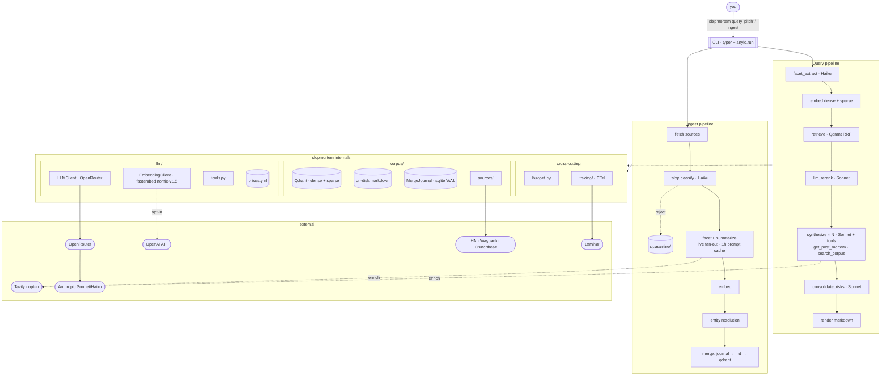

# Architecture



The CLI does one `anyio.run` per subcommand and that's it. Below that, every stage is `async def`. fastembed is CPU-bound, so it hops onto a thread via `anyio.to_thread.run_sync`. The synthesis fan-out goes through `gather_resilient` (an `anyio.gather` wrapper that returns exceptions instead of cancelling siblings). Each SDK keeps one connection pool alive for the whole invocation. You don't think that matters until you watch six sequential LLM calls each pay the TLS handshake tax.

## Query flow

You type `slopmortem query "we're building a marketplace for industrial scrap metal"`. Here's what runs.

1. **Facets.** Haiku reads the pitch and slaps structured fields on it: sector, business model, stage, that kind of thing. These narrow what we retrieve and feed the rerank rubric later.
2. **Embeddings.** Dense via fastembed `nomic-ai/nomic-embed-text-v1.5` (local ONNX, 768d). Sparse via fastembed BM25. Two vectors per query, both free.
3. **Retrieve.** Qdrant runs three prefetches in parallel (dense, sparse, and one filtered by your facets), then fuses them server-side with Reciprocal Rank Fusion. Top 30 come back. No HyDE, no query rewriting. We skipped HyDE because Haiku has a known habit of rewriting pitches as post-mortem openings stuffed with its favorite failure tropes ("ran out of runway", "scaled too fast"), and that would bias retrieval toward generic-failure clusters. Rerank at K=30 → N=5 should absorb the modality gap. Revisit in v2 if real-pitch recall measures poorly.
4. **Rerank.** One Sonnet call scores all 30 against a multi-perspective rubric. Output is JSON via OpenRouter's `response_format=json_schema`, which routes to Anthropic's grammar-constrained sampling on the backend. No tools, no corpus reads, nothing to parse out of prose. Top 5 survive.
5. **Synthesize.** The first call runs alone, on purpose. It writes the prompt cache so the other four don't race to write the same prefix. We assert `cache_creation_tokens > 0` on that warm response, because Anthropic's cache is eventually consistent across regions and a 200 OK doesn't actually mean the prefix replicated yet. One re-warm retry if it didn't. Then the rest fan out under `anyio.CapacityLimiter(N)` with `asyncio.gather(..., return_exceptions=True)`, so one flaky candidate drops one report instead of killing all five. The model can hit `get_post_mortem` or `search_corpus` mid-generation if it wants more context. The LLM emits an `LLMSynthesis`; the pipeline composes the user-visible `Synthesis` from it plus `failure_date` and `lifespan_months` derived from the candidate's typed `CandidatePayload`, so those two fields can't be fabricated from prose.
6. **Consolidate risks.** One Sonnet call reads the pitch and every per-candidate lesson, merges paraphrases, and drops anything that doesn't latch onto something concrete in the pitch. The Jaccard pass it replaced was happily emitting "don't use MLM" on pitches with no referral mechanic. Output is up to 10 risks, each with a severity bucket and an `applies_because` line that has to name a specific bit of the pitch. The stage caps highs at 4 and drops any fabricated `candidate_id` the model invents. Skipped on `BudgetExceededError`.
7. **Render.** Markdown to stdout. Top-risks section first when present, then per-candidate sections, then a footer with cost, latency, and the trace ID. Paste the Laminar link from the terminal when something looks off.

A default 5-comparable query runs around $0.10 warm / $0.30 cold cache and 90–130 seconds; the sample in [`docs/examples/crypto-savings-yield/`](examples/crypto-savings-yield/) recorded `cost=$0.14`, `latency=126.7s`. Tavily synthesis enrichment bumps both. Cap is $2.00; the budget tracker raises if you blow past it.

## Ingest flow

`slopmortem ingest` is the bulk path. Default sources are a curated YAML and HN's Algolia API; the Wayback Machine and a Crunchbase CSV are opt-in adapters. Tavily is an opt-in enricher (synthesis-time or ingest-time), not a source.

1. **Fetch.** Plain HTTP. trafilatura strips nav and cookie banners. A length floor drops the obviously empty pages.
2. **Slop classify.** Haiku scores each fetched body; anything above `slop_threshold` lands in `quarantine/` with no journal row and no embedding. `slopmortem ingest --reclassify` is the only way back.
3. **LLM fan-out.** Two calls per doc, one for facets and one for the rerank summary. All ~1000 run live under `anyio.CapacityLimiter(20)`. No Batches discount here because OpenRouter doesn't proxy that API. The shared system block sets `cache_control={"ttl":"1h"}`, and we fire one sync call right before the fan-out so workers hit a populated cache instead of racing to write it. The first five responses sample `cache_read_tokens / (cache_read + cache_creation)`. If the read ratio is under 80% we know before spending the rest of the budget. The 1-hour TTL recovers most of what Batches would have saved.
4. **Embed.** Dense and sparse both on the local CPU. fastembed downloads a 550 MB ONNX model on first use and caches it under `~/.cache/fastembed`. CI runs `slopmortem embed-prefetch` once so the first ingest doesn't pay the download tax.
5. **Entity resolution.** Three tiers. Domain match first, then embedding similarity, then a Haiku tiebreaker for the actually ambiguous pairs. The point of all this is to stop "Crunchbase obituary + founder's farewell blog post" from showing up as two separate dead startups.
6. **Merge.** Journal flips the row to `pending`, markdown lands via `os.replace`, Qdrant gets upserted, then the journal flips to `complete`. If something dies in the middle (Ctrl-C, OOM, bad network, whatever), `slopmortem ingest --reconcile` walks the three stores and patches whatever drifted.

The initial 500-URL seed costs about $7.50. The cap is $15 because retries happen, the no-Batches path has less cushion, and I wanted slack. Steady-state on the HN feed is roughly $0.10/week, small enough that I stopped tracking it.

## What's where

Underscore-prefixed submodules (`_foo.py`) are package-private; callers import
from the package's `__init__.py`. Listing them here is descriptive, not
prescriptive — the import contract is the package boundary.

```
slopmortem/
  pipeline.py              # query orchestration, async stage composition
  render.py                # Report → Markdown
  models.py                # InputContext, Report, Synthesis, shared Pydantic types
  config.py                # pydantic-settings; toml + env + .env
  budget.py                # per-invocation cost cap
  concurrency.py           # CapacityLimiter helpers and shared anyio plumbing
  http.py                  # shared httpx client + SSRF guard
  errors.py                # typed error hierarchy
  cli_progress.py          # Rich progress display shared by ingest/query/eval recorders
  deps.py                  # build_deps() — production (LLM, embedder, corpus, budget) tuple; shared by cli/ and evals.runner --live
  _time.py                 # monotonic / wall-clock helpers (tests patch one symbol)
  cli/
    __init__.py            # Typer entrypoint; subcommands registered by side-effect import
    _common.py             # shared helpers (config load, dep wiring) used by 2+ subcommands
    _query_cmd.py          # `slopmortem query`
    _ingest_cmd.py         # `slopmortem ingest`
    _replay_cmd.py         # `slopmortem replay`
    _embed_prefetch_cmd.py # `slopmortem embed-prefetch`
  ingest/
    __init__.py            # public surface: `ingest()`, IngestPhase, IngestResult, …
    _ingest.py             # top-level `ingest()` orchestration
    _ports.py              # Corpus / SlopClassifier protocols + IngestPhase / IngestResult / IngestProgress (leaf of import graph)
    _helpers.py            # pure helpers shared across ingest internals
    _impls.py              # InMemoryCorpus, FakeSlopClassifier, HaikuSlopClassifier (production stand-ins)
    _slop_gate.py          # slop classifier routing → quarantine/ or fan-out
    _warm_cache.py         # first-entry-alone prompt-cache warm pattern
    _fan_out.py            # per-entry facet → summarize → embed → upsert
    _journal_writes.py     # mark_pending → md write → qdrant upsert → mark_complete ordering
  stages/                  # facet_extract, retrieve, llm_rerank, synthesize, consolidate_risks
  llm/
    __init__.py            # public surface: clients, fakes, prompt rendering, tools
    client.py              # LLMClient Protocol + CompletionResult
    openrouter.py          # OpenRouterClient (openai SDK pointed at openrouter.ai/api/v1)
    fake.py                # FakeLLMClient for tests / cassette replay
    cassettes.py           # vcrpy-style record/replay shim for LLM calls
    embedding_client.py    # EmbeddingClient Protocol + EmbeddingResult
    embedding_factory.py   # provider-dispatch factory (fastembed | openai | fake)
    fastembed_client.py    # local ONNX (default; nomic-embed-text-v1.5)
    openai_embeddings.py   # OpenAI variant (text-embedding-3-{small,large})
    fake_embeddings.py     # deterministic Fake variant for tests
    tools.py               # synthesis_tools(config) factory; Pydantic → OpenAI-shape tool schema
    prices.yml             # source of truth for $$
    prompts/               # *.j2 templates with paired JSON Schemas
  corpus/
    __init__.py            # public surface: Corpus, MergeJournal, QdrantCorpus, …
    sources/               # curated, hn_algolia, crunchbase_csv, wayback, tavily
    _store.py              # Corpus read-side Protocol shared by query and ingest
    _qdrant_store.py       # hybrid retrieval (dense + sparse + facet RRF)
    _merge.py              # MergeJournal (stdlib sqlite3, WAL, busy_timeout=5000)
    _merge_text.py         # canonical-doc merge logic
    _db.py                 # shared sqlite3 connection helper
    _reconcile.py          # six-drift-class scan + repair
    _reclassify.py         # re-run slop check on quarantined docs
    _entity_resolution.py  # 3-tier dedupe (domain → embedding → Haiku tiebreak)
    _alias_graph.py        # canonical-id alias graph
    _chunk.py              # markdown → chunked vectors
    _embed_sparse.py       # fastembed BM25 / sparse vector path
    _extract.py            # trafilatura wrapper + length floor
    _summarize.py          # facet + rerank summary fan-out
    _disk.py               # raw/, canonical/, quarantine/ tree I/O
    _paths.py              # safe_path validation
    _tools_impl.py         # backing impls for synthesis_tools()
    taxonomy.yml           # sector / business-model / stage taxonomy
  tracing/
    __init__.py            # Laminar/OTel init guard; refuses non-loopback by default
    events.py              # closed StrEnum of span event names
  evals/                   # eval runner, cassette harness, corpus recorder (NEVER imported by prod)
post_mortems/              # default ingest root (override via --post-mortems-root)
  raw/<source>/<id>.md     # one file per fetched source doc
  canonical/<id>.md        # one file per merged canonical entry
  quarantine/<id>.md       # docs the slop classifier rejected
journal.sqlite             # merge journal; sibling of post_mortems_root
docs/specs/                # design spec + open issues
tests/
  fixtures/cassettes/      # pytest-recording (vcrpy under the hood, no respx)
  fixtures/                # corpus_fixture_inputs.yml, curated_test.yml, prompts/, injection/
  evals/                   # baseline.json, datasets/, eval-side tests
  {corpus,ingest,llm,sources,stages}/  # mirrors slopmortem/ subtree layout
  {evals,fakes}/                # eval harness tests + shared test fakes
```
